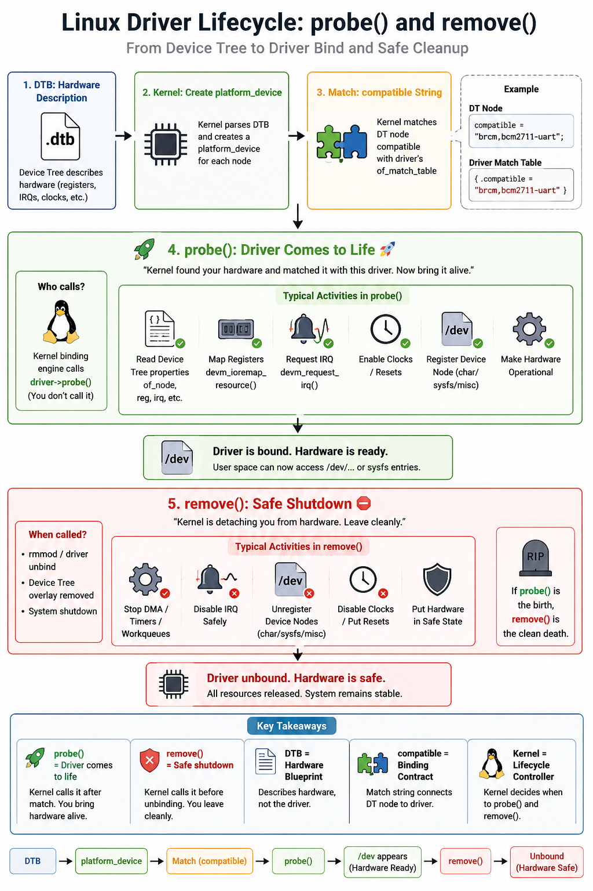

# Linux Device Model

## Video :-

[](https://www.youtube.com/watch?v=pB6NKmid8A4)

Before Linux 2.6, every subsystem managed its own devices in its own way.    
No shared model, no unified power management, no consistent hotplug.    

The **Linux Device Model (LDM)** was introduced to fix this by maintaining a single internal data structure that reflects exactly what hardware is in the system, how it is connected, which driver owns it, and how it can be powered down.

The kernel uses five entities to model the system:

Entity | What it represents
-------|-------------------
device | A physical device attached to a bus
driver | Software that can bind to and operate a device
bus | The channel connecting devices to the processor
class | A grouping of devices by function, not by connection (e.g. all disks, all serial ports)
subsystem | A high-level view of the system (devices, buses, classes, modules)

All of this is exposed to user space through the `sysfs` virtual filesystem, mounted at `/sys`.

Reference Doc :- https://linux-kernel-labs.github.io/refs/heads/master/labs/device_model.html

------

## 1. `kobject` : The Foundation of Everything

Before buses, devices, or drivers, there is `struct kobject`.    
It is the primitive that every LDM structure is built on.    
It provides:
* A **name** that appears as a directory in sysfs
* A **reference counter (kref)** the object is only freed when this hits zero
* A **parent pointer** builds the hierarchy tree
* A **kset** groups sibling objects at the same level

```c
struct kobject {
    const char          *name;
    struct list_head     entry;
    struct kobject      *parent;     // parent in the hierarchy
    struct kset         *kset;       // siblings at the same level
    struct kobj_type    *ktype;      // contains the release() method
    struct sysfs_dirent *sd;         // sysfs directory entry
    struct kref          kref;       // reference count
    /* ... state flags ... */
};
```
Linux uses composition instead of inheritance.

Rather than having a universal base class like C++,      
Linux embeds `struct kobject` inside higher-level objects.   
This gives every kernel object a common lifetime model,      
`sysfs` representation, and hierarchy, while still allowing each subsystem to extend the structure with its
own data.


Key rule: `struct kobject` is almost never used standalone. It is always embedded inside a higher-level structure:
 * `struct device`, 
 * `struct bus_type`, 
 * `struct cdev`, etc.     
We use `container_of()` to get back to the outer struct. (Ex:- [Dedicated Workqueue](../20_workqueue_and_bottom_halves/02_dedicated_workqueue/dedicated_wq_driver.c))


```c
/* Example: cdev embeds a kobject */
struct cdev {
    struct kobject kobj;   /* embedded */
    struct module *owner;
    const struct file_operations *ops;
    struct list_head list;
    dev_t dev;
    unsigned int count;
};
```

------

## 2. Buses

A bus is the communication channel between the processor and I/O devices.    
In LDM, **every device is connected to a bus**, even if it is a virtual one with no physical hardware.   
(like the platform bus used for hard-wired SoC peripherals on Raspberry Pi).

When a bus is registered, it appears under `/sys/bus/`.

#### ⊛ `struct bus_type`
```c
struct bus_type {
    const char              *name;
    struct device_attribute *dev_attrs;
    struct driver_attribute *drv_attrs;
    struct bus_attribute    *bus_attrs;

    int (*match)(struct device *dev, struct device_driver *drv);
    int (*uevent)(struct device *dev, struct kobj_uevent_env *env);
    int (*probe)(struct device *dev);
    int (*remove)(struct device *dev);
    /* ... */
};
```

The two most important callbacks:
* `.match()` ➡ called whenever a new device or driver appears on the bus; **returns non-zero** if they are compatible.
* `.uevent()` ➡ called before a hotplug event is sent to user space; **used to inject environment variables**.

#### ⊛ Registering a Custom Bus
```c
#include <linux/device.h>

/* match: compare device name to driver name */
static int my_match(struct device *dev, struct device_driver *drv)
{
    return !strncmp(dev_name(dev), drv->name, strlen(drv->name));
}

/* uevent: add a custom environment variable for udev */
static int my_uevent(struct device *dev, struct kobj_uevent_env *env)
{
    add_uevent_var(env, "DEV_NAME=%s", dev_name(dev));
    return 0;
}

struct bus_type my_bus_type = {
    .name   = "mybus",
    .match  = my_match,
    .uevent = my_uevent,
};

static int __init my_bus_init(void)
{
    return bus_register(&my_bus_type);   /* appears in /sys/bus/mybus/ */
}

static void __exit my_bus_exit(void)
{
    bus_unregister(&my_bus_type);
}
```

Bus Attributes
Buses can expose attributes as files under `/sys/bus/<name>/`.  
Use `BUS_ATTR` to define them:
```c
#define MY_BUS_DESCR "LDD Tutorial Bus"

static ssize_t my_show_descr(struct bus_type *bus, char *buf)
{
    return snprintf(buf, PAGE_SIZE, "%s\n", MY_BUS_DESCR);
}

/* Defines bus_attr_descr - visible as /sys/bus/mybus/descr */
BUS_ATTR(descr, 0444, my_show_descr, NULL);

/* In module_init: */
bus_create_file(&my_bus_type, &bus_attr_descr); /* /sys/bus/mybus/descr */

/* In module_exit: */
bus_remove_file(&my_bus_type, &bus_attr_descr);
```
------

## 3. Devices

Any physical (or virtual) device in the system is represented by `struct device`. Devices appear under `/sys/devices/`.

#### ⊛ `struct device`
```c
struct device {
    struct device          *parent;        // typically a controller or bus device
    struct device_private  *p;
    struct kobject          kobj;          // sysfs linkage
    const char             *init_name;
    struct bus_type        *bus;           // which bus owns this device
    struct device_driver   *driver;        // currently bound driver
    void (*release)(struct device *dev);   // called when ref count hits 0
    /* ... */
};
```
>> `struct device` is almost never used directly. It is embedded inside a bus-specific structure and retrieved with `container_of()`.

Defining a Bus-Specific Device Type:
```c
/* mybus.c */

struct my_device {
    char             *name;
    struct my_driver *driver;
    struct device     dev;      /* embedded struct device */
};

/* Parent device - represents the bus itself */
static void my_bus_device_release(struct device *dev) {}

static struct device my_bus_device = {
    .init_name = "mybus0",
    .release   = my_bus_device_release,
};

static void my_dev_release(struct device *dev) {}

int my_register_device(struct my_device *mydev)
{
    mydev->dev.bus     = &my_bus_type;
    mydev->dev.parent  = &my_bus_device;
    mydev->dev.release = my_dev_release;
    dev_set_name(&mydev->dev, mydev->name);
    return device_register(&mydev->dev);
}
EXPORT_SYMBOL(my_register_device);

void my_unregister_device(struct my_device *mydev)
{
    device_unregister(&mydev->dev);
}
EXPORT_SYMBOL(my_unregister_device);
```

From `mydriver.c`, using the exported bus API:
```c
static struct my_device mydev;
char devname[32];

sprintf(devname, "mydev0");
mydev.name   = devname;
mydev.driver = &mydriver;
dev_set_drvdata(&mydev.dev, &mydev);

err = my_register_device(&mydev);
```

Device Attributes

```c
static ssize_t my_show_type(struct device *dev,
                             struct device_attribute *attr, char *buf)
{
    struct my_device *mydev = container_of(dev, struct my_device, dev);
    return snprintf(buf, PAGE_SIZE, "%s\n", mydev->name);
}

/* Defines dev_attr_type - visible as /sys/devices/mybus0/mydev0/type */
DEVICE_ATTR(type, 0444, my_show_type, NULL);

/* After device_register: */
device_create_file(&mydev->dev, &dev_attr_type);

/* Before device_unregister: */
device_remove_file(&mydev->dev, &dev_attr_type);
```

-------------

## 4. Drivers

A driver registers itself with a bus. When a new device appears, the bus core calls `.match()` ➡ if it returns non-zero, the bus calls `.probe()` to bind the driver to the device.

Driver info appears across `sysfs`: `/sys/module/<name>/`, `/sys/bus/*/drivers/`, `/sys/class/*/`.

#### ⊛ `struct device_driver`

```c
struct device_driver {
    const char       *name;
    struct bus_type  *bus;
    struct module    *owner;

    int (*probe)   (struct device *dev);
    int (*remove)  (struct device *dev);
    void (*shutdown)(struct device *dev);
    int (*suspend) (struct device *dev, pm_message_t state);
    int (*resume)  (struct device *dev);
};
```
Defining a Bus-Specific Driver Type:
```c
/* mybus.c */

struct my_driver {
    struct module        *module;
    struct device_driver  driver;   /* embedded */
};

int my_register_driver(struct my_driver *drv)
{
    drv->driver.bus = &my_bus_type;
    return driver_register(&drv->driver);
}
EXPORT_SYMBOL(my_register_driver);

void my_unregister_driver(struct my_driver *drv)
{
    driver_unregister(&drv->driver);
}
EXPORT_SYMBOL(my_unregister_driver);
```

From `mydriver.c`:
```c
static int my_probe(struct device *dev)
{
    struct my_device *mydev = container_of(dev, struct my_device, dev);
    pr_info("probe: matched device %s\n", mydev->name);
    return 0;
}

static int my_remove(struct device *dev)
{
    pr_info("remove called\n");
    return 0;
}

static struct my_driver mydriver = {
    .module = THIS_MODULE,
    .driver = {
        .name   = "mydev0",   /* must match device name for our .match() */
        .probe  = my_probe,
        .remove = my_remove,
    },
};

/* In module_init: */
my_register_driver(&mydriver);

/* In module_exit: */
my_unregister_driver(&mydriver);
```

## 5. Classes

A class is a functional grouping of devices, independent of the bus or connection type.   

A class groups devices by user-visible functionality rather than by
how they are physically connected.

Example :- 

    USB disk
    SATA disk
    NVMe disk

    can all appear under similar functional interfaces.

* All block devices form a class.      
* All serial ports form a class.   
* we can define our own.


Classes appear under `/sys/class/<classname>/`.
>> The biggest practical reason to use classes:      
>> `udev` reads the dev attribute file that `device_create()` places under `/sys/class/`,   
>> the file contain major and minor number,
>> `udev` reads that file automatically call `mknod` to create the `/dev/` node,  no manual `mknod` required.   
>> see the complet example [Character Device Driver](https://youtu.be/9B-jT8QIVy8?t=1032) 

#### ⊛ `struct class`
```c
struct class {
    const char   *name;
    struct module *owner;
    /* attribute lists, uevent cb, release cb ... */
};
```

Two-Step Class API   

**Step 1** : Register the class (once, at module init)
```c
static struct class my_class = {
    .name  = "myclass",
    .owner = THIS_MODULE,
};

/* In module_init: */
err = class_register(&my_class);   /* appears in /sys/class/myclass/ */

/* In module_exit: */
class_unregister(&my_class);
```

Shorthand using `class_create()` (allocates + registers in one call):

```c
struct class *my_class = class_create(THIS_MODULE, "myclass");
if (IS_ERR(my_class)) return PTR_ERR(my_class);

/* cleanup: */
class_destroy(my_class);
```
**Step 2** : Create a device under the class (in `probe()` or after `cdev_add()`)

```c
/*
 * device_create() does three things:
 *   1. Initialises a struct device and links it to my_class
 *   2. Creates /sys/class/myclass/myclass0/dev  (contains "major:minor")
 *   3. Fires a uevent → udevd reads 'dev' → calls mknod → /dev/myclass0 appears
 */
struct device *dev_node;
dev_node = device_create(&my_class, NULL, cdev.dev, NULL, "myclass0");
if (IS_ERR(dev_node))
    return PTR_ERR(dev_node);

/* In remove() / module_exit - always reverse order: */
device_destroy(&my_class, cdev.dev);
class_unregister(&my_class);   /* or class_destroy() if using class_create() */
```
----------------

## 6. The Real Meaning of `probe()` and `remove()`

Most engineers think Linux driver writing is just `module_init()` → register → done.     
But Linux doesn't work that way. The real lifecycle is controlled by the kernel's binding engine:
```
┌─────┐   ┌─────────────────┐   ┌─────────┐  ┌─────────┐
| DTB | → | platform_device | → | match() |→ | probe() |
└─────┘   └─────────────────┘   └─────────┘  └────┬────┘
                                                  ▼  
                                           ┌──────────────┐
                                           | /dev appears |
                                           └──────┬───────┘
                                                  ▼       
                                           ┌──────────────┐
                                           |  remove()    |
                                           └──────┬───────┘
                                                  ▼
                                           ┌──────────────┐ 
                                           |   cleanup    |
                                           └──────┬───────┘
                                                  ▼
                                          hardware safe state

```



### `probe()` is NOT `module_init()`

`probe()` means exactly one thing:

> **"The kernel found our hardware and matched it with this driver. Now bring it alive."**

The kernel decides *when* probe runs. It fires when the bus core matches
a device to our driver, whether that's at boot, on `insmod`, or when a Device Tree
overlay is applied live.

Inside `probe()` we typically:

- Read Device Tree properties (`of_property_read_u32`, `of_get_gpio`, ...)
- Map registers - `devm_ioremap_resource()`
- Request IRQ - `devm_request_irq()`
- Enable clocks and resets
- Register the device node (char device, sysfs, misc)
- Make the hardware operational

### `remove()` is the driver's safe shutdown

`remove()` is called when:
- `rmmod` happens
- The device unbinds or a DT overlay is removed
- The system shuts down

> **"The kernel is detaching from hardware. Leave cleanly."**

Inside `remove()` we ensure:
- DMA, timers, and workqueues are stopped
- IRQs are disabled safely
- Device nodes are unregistered
- Hardware is left in a safe state

> If `probe()` is the birth, `remove()` is the clean death.

### DTB (Device Tree Blob) doesn't "call" our driver

Device Tree only *describes* hardware. The real glue is the `compatible` string:

```c
/* Device Tree node */
uart0: uart@7e201000 {
    compatible = "brcm,bcm2711-uart";
    /* ... */
};

/* Driver match table */
static const struct of_device_id my_of_match[] = {
    { .compatible = "brcm,bcm2711-uart" },
    { /* sentinel */ }
};
MODULE_DEVICE_TABLE(of, my_of_match);
```

Match happens → kernel binds device ↔ driver → `probe()` runs. That's the contract.

### How `container_of()` fits in

Inside `probe()`, the kernel passes we a generic `struct device *` (or
`struct platform_device *`). our private data lives in a larger struct that
*wraps* that device. `container_of()` is how we get back to it:

```c
struct my_device {
    int hw_version;
    void __iomem *base;
    struct device dev;      /* embedded - kernel hands a pointer to this */
};

static int my_probe(struct device *dev)
{
    /* Walk back from the embedded dev to the outer my_device */
    struct my_device *mydev = container_of(dev, struct my_device, dev);

    mydev->base = devm_ioremap_resource(dev, res);
    mydev->hw_version = readl(mydev->base + HW_VER_REG);

    dev_info(dev, "probe: hw version %d\n", mydev->hw_version);
    return 0;
}

static int my_remove(struct device *dev)
{
    struct my_device *mydev = container_of(dev, struct my_device, dev);
    /* devm_* resources are freed automatically - just undo what devm didn't cover */
    dev_info(dev, "remove: hardware in safe state\n");
    return 0;
}
```

`container_of(ptr, type, member)` expands to pointer arithmetic:
it subtracts the offset of `member` inside `type` from `ptr`,
giving we the address of the enclosing struct.

### Summary

| | What it means |
|---|---|
| `probe()` | Driver comes to life ➡ kernel found and matched our hardware |
| `remove()` | Safe shutdown ➡ kernel is detaching from hardware |
| DTB | Hardware blueprint only ➡ does not call our driver |
| `compatible` | The binding contract between DT node and driver match table |
| `container_of()` | Gets our private struct back from the embedded `struct device *` |
| Kernel | Lifecycle controller ➡ we don't choose when probe/remove run |

## 7. Hotplug & Uevents

`Hotplug` is the ability to add or remove a device while the system is running without rebooting. A `uevent` is the kernel notification to user space when this happens.

**Uevents** are generated whenever a `kobject` is added to or removed from the kernel. Because every struct device embeds a `kobject`, creating or destroying a device automatically fires a **uevent**.

#### Uevent Flow
```
kobject created / destroyed
         │
         ▼
kobject_uevent(kobj, KOBJ_ADD / KOBJ_REMOVE / KOBJ_CHANGE)
         │
         ▼
   Netlink socket
         │
         ▼
      udevd (userspace daemon)
         │
         ├─► Applies /etc/udev/rules.d/ rules
         ├─► Creates or removes /dev nodes
         └─► Loads modules via MODALIAS (modprobe)
```

#### Adding Custom Environment Variables

The `.uevent()` callback in `struct bus_type` lets you inject variables that `udev` rules can read:
```c
static int my_uevent(struct device *dev, struct kobj_uevent_env *env)
{
    add_uevent_var(env, "DEV_NAME=%s", dev_name(dev));
    return 0;
}
```

#### Monitoring Uevents on Raspberry Pi

```bash
# Terminal 1 - watch events as they fire
udevadm monitor --kernel --udev

# Terminal 2 - load/unload your module
sudo insmod mydriver.ko
sudo rmmod mydriver

# Inspect the uevent file for a device
cat /sys/class/myclass/myclass0/uevent

# Manually trigger a uevent (for testing udev rules)
udevadm trigger --action=add /sys/bus/mybus/devices/mydev0
```
-------

## 8. `sysfs` 

`sysfs` is not a real filesystem stored on disk.   
It is generated dynamically from kernel `kobjects`.    
Every directory and attribute file reflects live kernel objects.     

#### The Full `sysfs` Map
```
/sys/
├── bus/
│   └── mybus/
│       ├── devices/        ← symlinks to /sys/devices/...
│       │   └── mydev0 ──► /sys/devices/mybus0/mydev0/
│       ├── drivers/
│       │   └── mydev0/
│       └── descr           ← bus attribute 
|                                (BUS_ATTR)
│
├── devices/
│   └── mybus0/             ← parent bus device
│       └── mydev0/         ← device kobject directory
│           ├── driver ──►  /sys/bus/mybus/drivers/mydev0/
│           ├── uevent
│           └── type        ← device attribute (DEVICE_ATTR)
│
├── class/
│   └── myclass/
│       └── myclass0/
│           └── dev         ← "major:minor" 
|                              read by udev to create /dev node
│
└── module/
    └── mydriver/
```

## 9. Summary

Concept | Role 
--------|------
`struct kobject `| Foundation ➡ reference counting, sysfs directory, parent hierarchy     
`struct bus_type` | Defines `.match()` and `.uevent()`; owns device and driver lists   
`bus_register()` | Registers bus ➡ `/sys/bus/<name>/`   
`BUS_ATTR` + `bus_create_file()` | Adds attribute files under `/sys/bus/<name>/`    
`struct device` | Represents one device; always embedded in a bus-specific struct   
`device_register()` | Adds device to bus ➡ `/sys/devices/`
`DEVICE_ATTR` + `device_create_file()` | Adds attribute files under the device's `sysfs` dir     
`struct device_driver` | Defines `.probe()` and `.remove()`; always embedded in bus-specific struct  
`driver_register()` | Registers driver ➡ bus calls .match() against all known devices
`struct class` | Functional grouping ➡ `/sys/class/<name>/`
`class_register()` / `class_create()` | Registers the class
`device_destroy()` | Removes device from class; always pair with `device_create()`
uevent | Fired on every kobject add/remove/change ➡ consumed by udevd


* Check :- [Example](./example/)
* Check :- [Platform Driver vs Character Device Driver Registration](./platform_vs_charecter_device_driver/readme.md)


