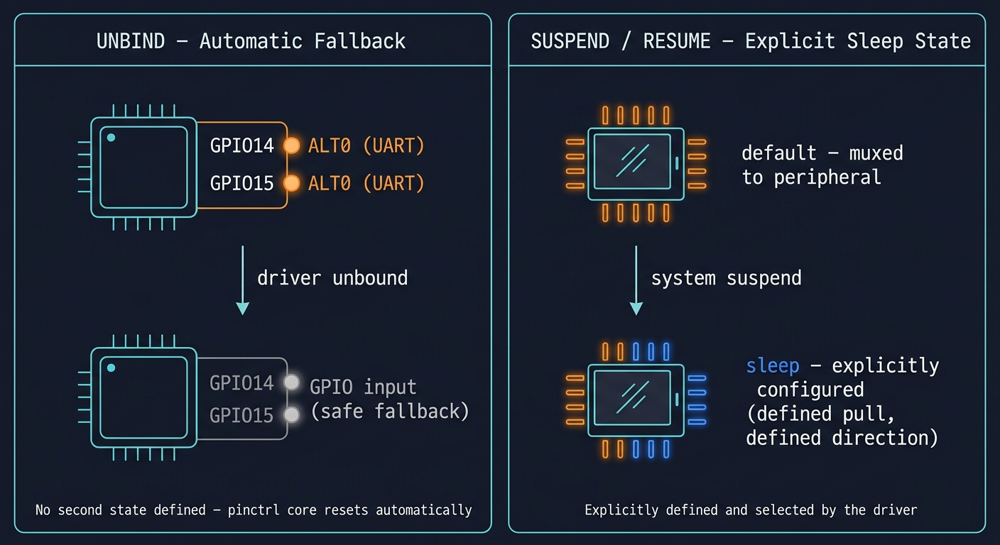

# Pin Control & Pinmux

## Video :-

[](https://www.youtube.com/watch?v=h9DxOG50sAk)


## 1. What Is Pin Control?

Every GPIO pin on the Raspberry Pi's SoC can usually do more than one job. GPIO14, for example, can be a plain digital I/O pin, or it can be routed internally to the UART peripheral as TXD. That routing decision is called **pin muxing**, and the kernel subsystem that manages it is **pinctrl**.

On most SoCs, pinctrl and GPIO are two separate hardware blocks. On the BCM283x / BCM2711 (the chips behind every Raspberry Pi model), they are the same block - the GPIO controller itself does both jobs. That's why in the device tree, pin configuration nodes live directly under `&gpio` instead of under a separate `&pinctrl` node.

Two things happen in this space:

- **Muxing** : picking which internal peripheral (if any) a pin is connected to
- **Configuration** : pull-up/pull-down, drive strength, etc., for whatever the pin is currently muxed to

## 2. Pin Configuration in Device Tree

A pin config node under `&gpio` uses three Broadcom-specific properties:

| Property | Meaning |
|---|---|
| `brcm,pins` | List of GPIO numbers this node configures |
| `brcm,function` | Function code for each pin (see table below) |
| `brcm,pull` | Pull state for each pin: `0` = none, `1` = pull-down, `2` = pull-up |

### `brcm,function` values

| Value | Meaning |
|---|---|
| 0 | GPIO input |
| 1 | GPIO output |
| 2 | ALT5 |
| 3 | ALT4 |
| 4 | ALT0 |
| 5 | ALT1 |
| 6 | ALT2 |
| 7 | ALT3 |

These map directly onto the 3-bit `FSEL` field inside the SoC's `GPFSELn` registers. the same registers you'd normally poke by hand if you were writing this without the DT/pinctrl framework at all.

A device that wants to use a particular pin configuration references it through two standard properties:

```dts
pinctrl-names = "default", "alt0";
pinctrl-0 = <&pinctrl_demo_default>;
pinctrl-1 = <&pinctrl_demo_alt0>;
```

`pinctrl-names` is a list of labels. `pinctrl-N` points at the phandle of the pin config node that corresponds to the name at **index N**. The state named `"default"` is special - the kernel automatically applies it right before your driver's `probe()` runs, with no extra code required.

## 3. Alternate Functions on Raspberry Pi Pins

Every GPIO has up to six alternate functions (ALT0-ALT5) wired to different on-chip peripherals. The mapping is fixed in hardware and documented in the BCM2835/BCM2711 peripheral datasheets. A few commonly used ones:

| Pin | ALT0 | ALT5 |
|---|---|---|
| GPIO14 | UART0 TXD | UART1 (mini-UART) TXD |
| GPIO15 | UART0 RXD | UART1 (mini-UART) RXD |
| GPIO2 | I2C1 SDA | - |
| GPIO3 | I2C1 SCL | - |
| GPIO18 | PCM_CLK | PWM0 |

This is also exactly what's been happening behind the scenes in the I2C driver from Tutorial 27 - `raspi-config` or the `dtoverlay=i2c1` line in `config.txt` is, under the hood, muxing GPIO2/GPIO3 to ALT0.

## 4. Example Files

| File | Purpose |
|---|---|
| `pinctrl-demo-overlay.dts` | Overlay defining two pin states and a dummy consumer device |
| `pinctrl_demo.c` | Platform driver that requests both states and switches between them via sysfs |

### `pinctrl-demo-overlay.dts`

Two fragments:

- **Fragment 0** adds two pin config nodes under `&gpio`:
  - `pinctrl_demo_default` : GPIO17 as a plain output, no pull
  - `pinctrl_demo_alt0` : GPIO14/15 as ALT0 (UART), RXD pulled up
- **Fragment 1** adds a dummy platform device, `mpcoding,pinctrl-demo`, whose `pinctrl-0`/`pinctrl-1` point at those two states.

### `pinctrl_demo.c`

- `devm_pinctrl_get()` : grabs the pinctrl handle for this device (this doesn't apply anything by itself)
- `pinctrl_lookup_state()` : resolves the `"default"` and `"alt0"` labels to `pinctrl_state` pointers
- `pinctrl_select_state()` : actually applies a state to hardware; called once in `probe()` to make sure we start from a known state, and again from the sysfs `store` callback to switch on demand
- A `pin_state` sysfs attribute (`show`/`store`) lets you flip between `"default"` and `"alt0"` from userspace, in the same style as the sysfs work from Tutorial 22

## 5. Build & Test

### Build source and overlay using Makefile
```bash
make
```

### load the driver and the overlay
```bash
make load
```

Expected `dmesg` output:

```
[*********] pinctrl_demo pinctrl_demo@0: pinctrl demo probed, GPIO17 is now an output
```

### Confirm GPIO17's function

```bash
raspi-gpio get 17
```

Expected output:

```
GPIO 17: level=0 func=INPUT pull=DOWN
```
### Switch to ALT0 and back

```bash
cat /sys/devices/platform/pinctrl_demo@0/pin_state
# default

echo alt0 | sudo tee /sys/devices/platform/pinctrl_demo@0/pin_state
dmesg | tail -1
# pinctrl_demo pinctrl_demo@0: pin state switched to "alt0"

raspi-gpio get 14 15
# GPIO 14: level=1 alt=0 func=TXD0 pull=NONE
# GPIO 15: level=1 alt=0 func=RXD0 pull=UP

echo default | sudo tee /sys/devices/platform/pinctrl_demo@0/pin_state
```
### Unload

```bash
make unload
```
## 6. Summary

| Concept | Where it lives |
|---|---|
| Pin muxing + config | Inside `&gpio` in the device tree, via `brcm,pins` / `brcm,function` / `brcm,pull` |
| Which state a device wants | `pinctrl-names` + `pinctrl-N` on the consumer node |
| Automatic default state | Applied by the kernel before `probe()`, no driver code needed |
| Manual state switching | `pinctrl_lookup_state()` + `pinctrl_select_state()` in driver code |

------------------------

>> **So to summarize:** unbinding relies on the automatic fallback, while suspend and resume, when used, rely on an explicitly defined state.




